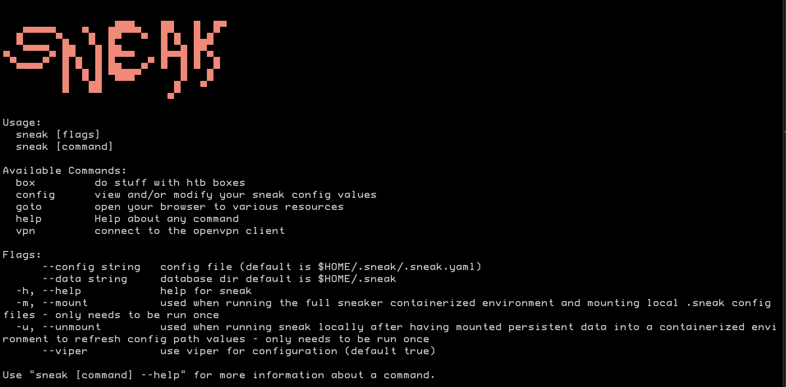
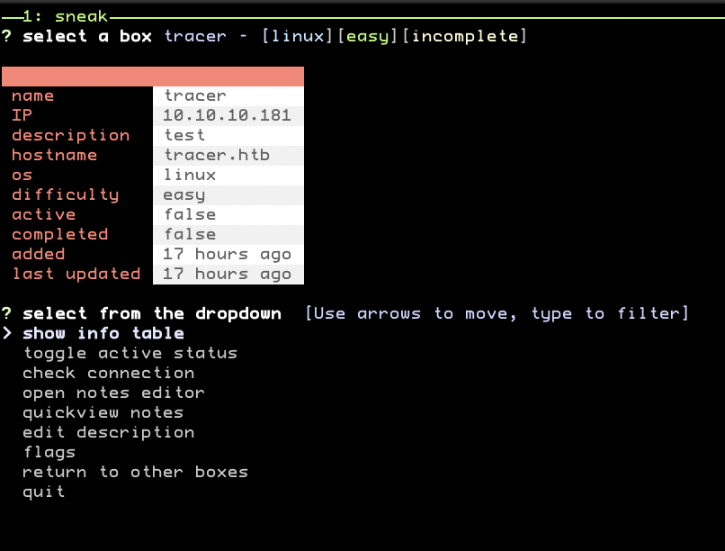

# sneak

`sneak` is a command line tool written for doing `hack the box` CTF challenges. the repository also includes an image for running sneak in a pre-baked containerized environment adapted for `sneak` that enables the user to connect to the `htb` VPN and run a reverse proxy (via `privoxy`) in their `sneaker` container. this permits end users to access `htb` sites from their native browser without needing to run a full virtual machine.

the purpose of `sneak` is to make managing data about these box challenges easier and more organized, while providing straightforward means to streamline and document one's findings. 

`sneak` also aggregates common operations into simple pipelines that perform standard, initial vulernability checks against targets. these pipelines are not static, though, as `sneak` gives users the ability to define their own custom security pipelines for tools and scripting.



### quickstart

```
git clone git@github.com:kathleenfrench/sneak.git
cd sneak
make up
```

----

## use

after installing `sneak`, you will be prompted on the initial run for a few config values it needs to run, like your `hack the box` username. these configs only need to be set once, but can be updated at any time via `sneak config update`. 

### connecting to the hack the box VPN

after your configs have been set, run:

```
sneak vpn setup
```

this will prompt you for your generated `.ovpn` file from `hack the box' and create your `privoxy` config file so you can connect to the container locally via reverse proxy.

to actually connect, run:

```
sneak vpn connect
```

this will start the `openvpn` client and [`privoxy`](https://www.privoxy.org/). you can always verify your connection with:

```
sneak vpn test
```

### boxes

the purpose of `sneak` is making it easier to manage environments and data between 'boxes', and streamlining that workflow. to that end, you can add and modify boxes in `sneak` at any time. (read [sneak db](#the-sneak-db) for more on the `sneak` database). 

#### add a new box

```
sneak box new
```

then follow the onscreen prompts!

#### view all of your boxes

```
sneak box list
```

this will launch a dropdown list of your configured boxes in the terminal that you can choose to interact with.

#### working with your boxes

each selected box has its own dedicated drodown, with many available options:



- toggle a box to `active` to set it as your current challenge
- update box information
- view metadata about the box (difficulty, OS, date created, last updated)
- check your connection status
- edit notes about that box in your default editor
- quickview your notes in rendered markdown
- view and set the `user` and `root` flags
- return to the main menu with all of your boxes

----

## docker environment(s)

#### running sneak in docker

running `sneak`'s containerized environment, `sneaker`, is very simple:

```
	@docker run \
		--privileged \
		--sysctl net.ipv6.conf.all.disable_ipv6=0 \
		--env LOCAL_NETWORK=$(local_network) \
		--cap-add=NET_ADMIN \
		-p 8118:8118 \
		-it sneaker \
		 /bin/sh
```

##### running the container as a custom user

if you want to set your `hack the box` username as the container user, create an `env.mk` file with the following:

```
## env.mk
HTB_USERNAME := yourusername
```

this value will be imported when you run build and run the `sneaker` image, which is simplest to do via the `Makefile`'s `up` command:

```
make up
```

which will handle building the image with your custom user info and starting the container


##### mounting your local data

if you want to persist/mount data from your local installation of `sneak`, add volume flags to the above `docker run` command, i.e.:

```
	@docker run \
		--privileged \
		--sysctl net.ipv6.conf.all.disable_ipv6=0 \
		--env LOCAL_NETWORK=$(local_network) \
		--cap-add=NET_ADMIN \
		-v (SEE BELOW)
		-v $(CWD)/build/sneak:/go/bin/sneak \
		-p 8118:8118 \
		-it sneaker \
		 /bin/sh
```

if you are using the **default** `sneaker` image (which is the `sneak` user), use the following `--volume` flag:

```
-v $(HOME)/.sneak/:/home/sneak/.sneak
```

if you are running the `sneaker` image as a **custom user** (with your `hack the box` username), use the following `--volume` flag:

```
-v $(HOME)/.sneak/:/home/$(HTB_USERNAME)/.sneak
```

once you're in the container and want to run `sneak` just append the `--mount` (`-m`) flag a single time to update your config files to the correct path.

```
sneak --mount (-m)
```

if you want to switch back to running `sneak` outside of docker with the same persisted files, run:

```
sneak --unmount (-u)
```

----

## the sneak db

`sneak` uses [`bolthold`](https://github.com/timshannon/bolthold) (which wraps `boltdb`) to manage data locally beyond the user's custom configurations at the application level. if you want to interact with the database, there's a hidden command (`sneak db`) that will enable you to view the bucket(s), reset the database, as well as back it up
